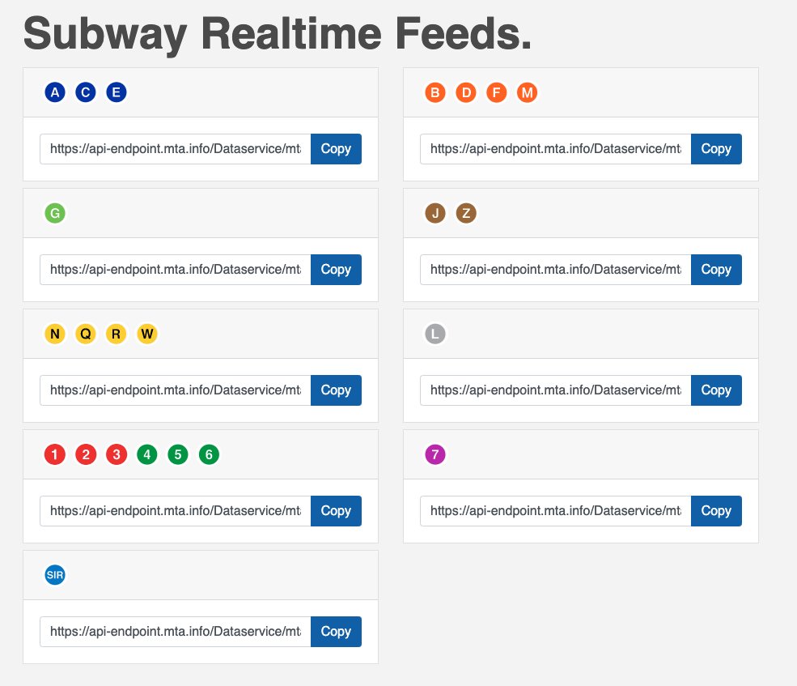

There are 9 Realtime Subway feeds, which are listed [here](https://api.mta.info/#/subwayRealTimeFeeds). They are all the same except for the last 1 - 4 characters (except the 123456 feed which is just the base url).

| Lines | Endpoint |
| --- | ----------- |
| ACE: | [https://api-endpoint.mta.info/Dataservice/mtagtfsfeeds/nyct%2Fgtfs-ace](https://api-endpoint.mta.info/Dataservice/mtagtfsfeeds/nyct%2Fgtfs-ace) |
| BDFM: | [https://api-endpoint.mta.info/Dataservice/mtagtfsfeeds/nyct%2Fgtfs-bdfm](https://api-endpoint.mta.info/Dataservice/mtagtfsfeeds/nyct%2Fgtfs-bdfm) |
| G: | [https://api-endpoint.mta.info/Dataservice/mtagtfsfeeds/nyct%2Fgtfs-g](https://api-endpoint.mta.info/Dataservice/mtagtfsfeeds/nyct%2Fgtfs-g) |
| JZ: | [https://api-endpoint.mta.info/Dataservice/mtagtfsfeeds/nyct%2Fgtfs-jz](https://api-endpoint.mta.info/Dataservice/mtagtfsfeeds/nyct%2Fgtfs-jz) |
| NQRW: | [https://api-endpoint.mta.info/Dataservice/mtagtfsfeeds/nyct%2Fgtfs-nqrw](https://api-endpoint.mta.info/Dataservice/mtagtfsfeeds/nyct%2Fgtfs-nqrw) |
| L: | [https://api-endpoint.mta.info/Dataservice/mtagtfsfeeds/nyct%2Fgtfs-l](https://api-endpoint.mta.info/Dataservice/mtagtfsfeeds/nyct%2Fgtfs-l) |
| 123456: | [https://api-endpoint.mta.info/Dataservice/mtagtfsfeeds/nyct%2Fgtfs](https://api-endpoint.mta.info/Dataservice/mtagtfsfeeds/nyct%2Fgtfs) |
| 7: | [https://api-endpoint.mta.info/Dataservice/mtagtfsfeeds/nyct%2Fgtfs-7](https://api-endpoint.mta.info/Dataservice/mtagtfsfeeds/nyct%2Fgtfs-7) |
| SIR: | [https://api-endpoint.mta.info/Dataservice/mtagtfsfeeds/nyct%2Fgtfs-si](https://api-endpoint.mta.info/Dataservice/mtagtfsfeeds/nyct%2Fgtfs-si) |
